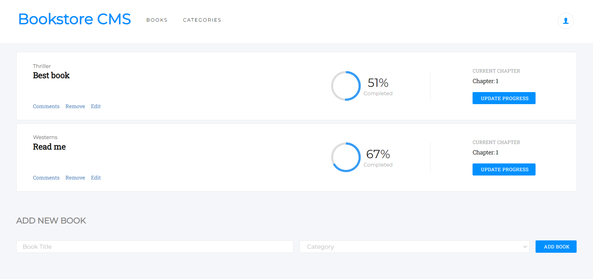
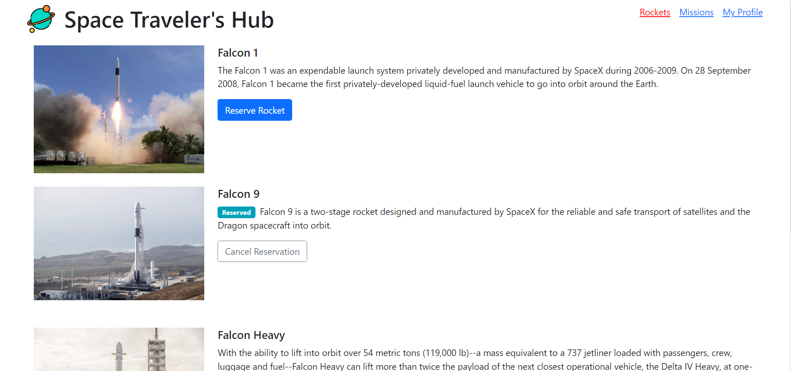

# portfolio-simple
Portfolio of various Apps built as practice imitating real-world examples.

## Book Store

- [Source code](https://github.com/damdafayton/bookstore)
- [Live](https://damdafayton.github.io/bookstore/build/)

### Built With
  - HTML, CSS, JavaSscript
  - Bootstrap, SCSS, React
  - Redux
  

## Space Hub - Group Project

- [Source code](https://github.com/damdafayton/group-project-spacehub)
- [Live](https://damdafayton.github.io/group-project-spacehub/build)

### Built With
  - HTML, CSS, JavaSscript
  - Bootstrap, SCSS, React
  - Redux
  - API (spacexdata.com)

## Coin Prices - Capstone Project

- [Source code](https://github.com/damdafayton/capstone-javascript)
- [Live](https://damdafayton.github.io/capstone-javascript/dist/)

### Built With
  - HTML, CSS, JavaSscript
  - Bootstrap, SCSS
  - API (coingecko.com)

## Math-magicians / Calculator

- [Source code](https://github.com/damdafayton/math-magicians)
- [Live](https://damdafayton.github.io/math-magicians/build/)

### Built With
  - HTML, CSS, JavaSscript
  - Bootstrap, SCSS, React

## To-Do List App

- [Source code](https://github.com/damdafayton/to-do-list)
- [Live](https://damdafayton.github.io/to-do-list/dist)

## Leaderboard

- [Source code](https://github.com/damdafayton/leader-board)
- [Live](https://damdafayton.github.io/leader-board/dist/)

## Rock-Paper-Scissor

- [Source code](https://github.com/damdafayton/rock-paper-scissors)
- [Live](https://damdafayton.github.io/rock-paper-scissors/)

### Built With
  - JavaScript

## Score Keeper

- [Source code](https://github.com/damdafayton/score-keeper)
- [Live](https://damdafayton.github.io/score-keeper/)

## Awesome Books

- [Source code](https://github.com/damdafayton/awesome-books)
- [Live](https://damdafayton.github.io/awesome-books/dist/)

